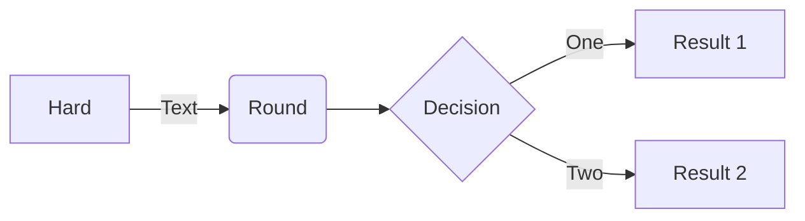
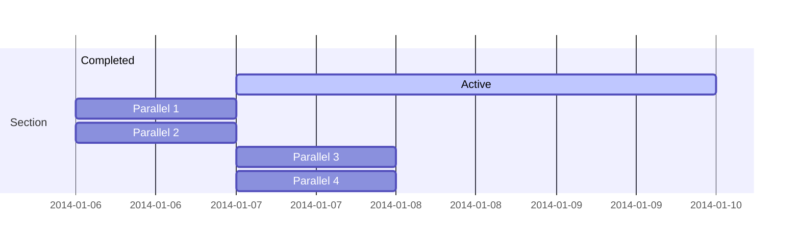
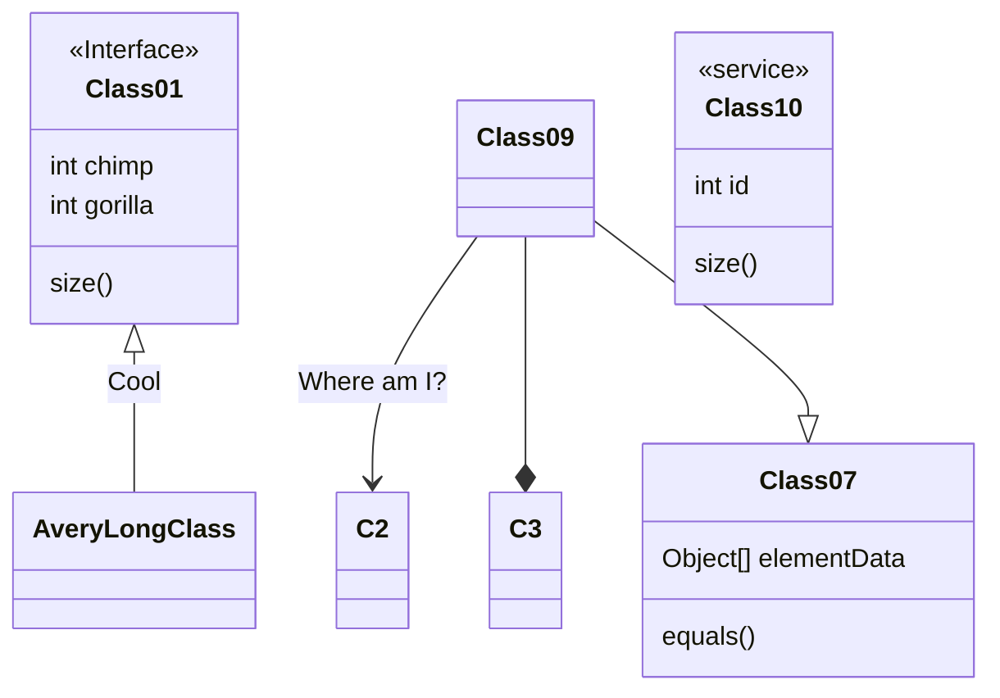

# PlantUML 渲染
@startuml
Alice -> "Bob()" : Hello
"Bob()" -> "This is very long" as Long
' You can also declare:
' "Bob()" -> Long as "This is very long"
Long --> "Bob()" : ok
@enduml

[TOC]
# Directory

## Level-1 Directory
This is a Level-1 directory.

### Level-2 Directory
This is a Level-1 directory.

## Level-1 Directory
This is a Level-1 directory.

# Flow Chart

# Gantt

# Class Diagram
